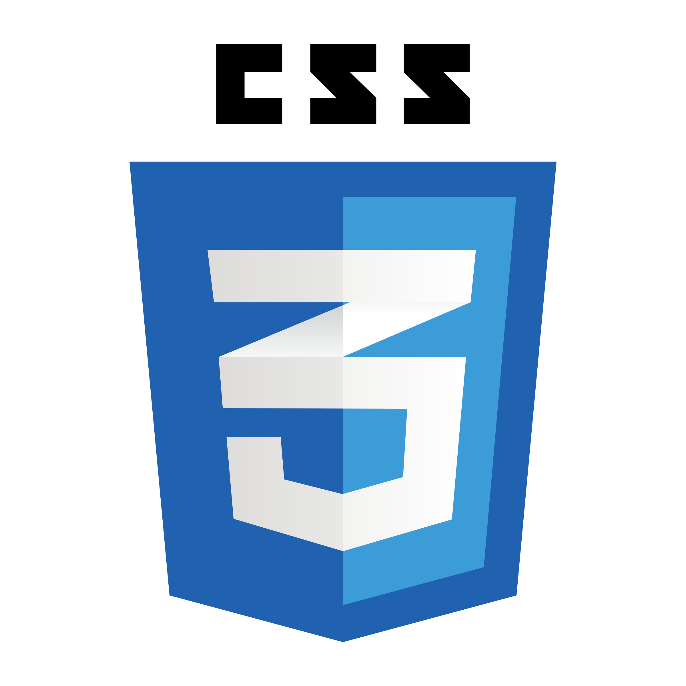
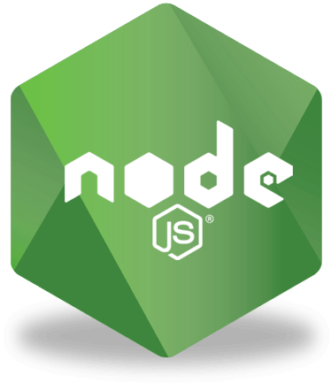
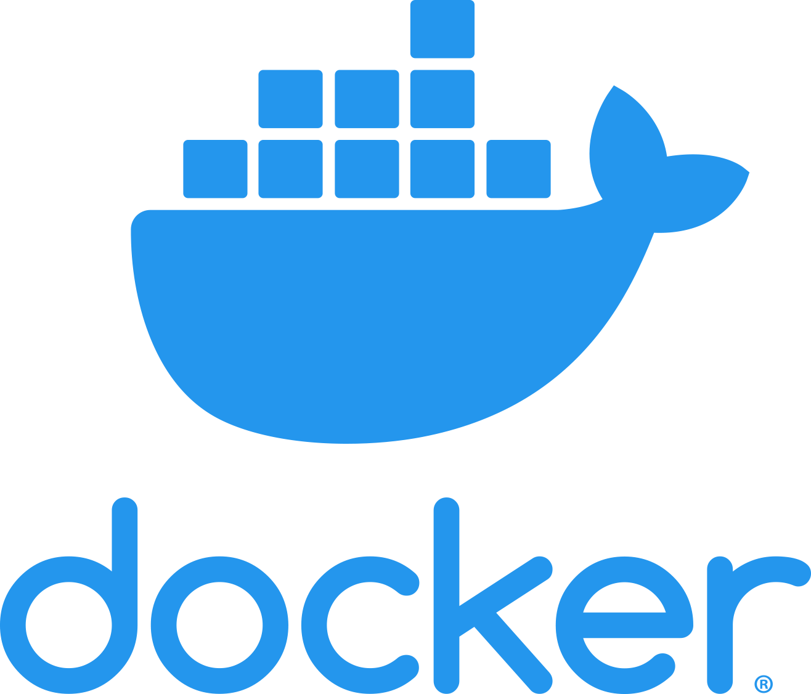
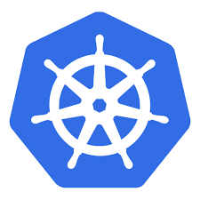
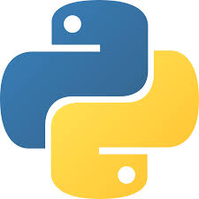
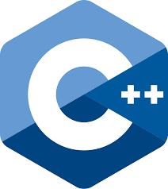

<!-- Futuristic GitHub Profile README for Parakrama Rathnayaka -->

<h1 align="center">
  🚀 Parakrama Rathnayaka  
   
  
</h1>

  
  
  

---

## 🌌 About Me

> *"Turning complex ideas into scalable, automated, and future-proof systems."*

- 🎓 **BSc (Hons)** in Computer Science & Engineering — *University of Moratuwa*
- 💼 Aspiring **Top-Tier DevOps Engineer** with full-stack development expertise
- 🛠 Passionate about **Cloud Infrastructure, Kubernetes, CI/CD, Microservices**
- 📡 Constant learner — keeping up with **AWS, Terraform, and Cloud-Native trends**
- 🎯 Focused on **scalability, automation, and production-grade architectures**

---

## 🛠 Tech Arsenal

### 💻 Frontend

   
   
   
   
   
   
  

### ⚙️ Backend

   
   
   
   
   
  

### 🚀 DevOps

   
   
   
   
   
  

### 🔮 Others

   
   
   
   
   
   
   
  

---

## 🚧 Featured Projects

| Project | Description | Tech Stack | Status |
|---------|-------------|------------|--------|
| [Collaborative Project Management Tool](https://github.com/MidLaneX/frontend.git) | Real-time collaboration platform with microservices & Kafka | Spring Boot, React, PostgreSQL, Docker, CI/CD | 🛠 Ongoing |
| [Smart Supply Chain Management](https://github.com/Parawork/Warehouse-Management-Services) | Intelligent warehouse management with REST APIs & automation | Django, PostgreSQL, Supabase, Docker | ✅ Completed |
| [AI-Powered Resume Analysis](https://jsm-resume-7rk7.puter.site) | AI-driven resume scoring & optimization insights | React, Tailwind, Docker | ✅ Completed |
| [Medilink](https://medi-link-mu.vercel.app/) | Healthcare platform with role-based access & secure data | Next.js, MongoDB, Tailwind | ✅ Completed |
| [Enterprise E-commerce](https://github.com/Parawork/E-commerce-platform) | Scalable e-commerce with secure payments & order mgmt | React, Express, MySQL, Docker | ✅ Completed |

---

## 🎓 Education

- **High School:** *Maliyadeva Boys' College* (2019-2021) — Science stream  
- **Undergraduate:** *University of Moratuwa* (2022-Present) — CSE

---

## 📈 GitHub Stats

  
  

---

## 📫 Let's Connect

  
  
  

